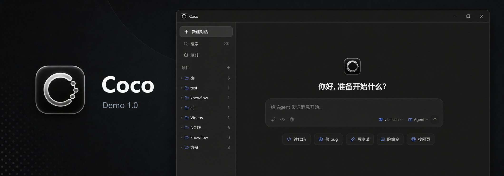

<p align="center">
  
</p>

<h1 align="center">Coco</h1>

<p align="center">
  一个面向桌面端的 AI Agent 客户端 Demo。
  <br />
  目前处于 Demo 1.0 阶段，优先验证安装、配置和基础对话流程。
</p>

<p align="center">
  
  
  
  
</p>

---

## 这是什么？

Coco 是一个基于 **Tauri + Rust + React + TypeScript** 的桌面 AI Agent 客户端。

Demo 1.0 主要验证三个基础目标：可以安装、可以在界面里配置 Key、可以进行基础对话和工具调用展示。

## 当前状态

Demo 1.0 已经可以作为早期体验版本使用，但还不是成熟稳定版。界面里有些能力会明确标注 `开发中...`，这是刻意保留的真实状态，不会把未完成能力包装成已完成。

已经接通或可体验的部分：

- 桌面安装包构建，当前版本号 `1.0.0`
- 暗色默认界面
- 项目列表、会话列表、对话输入区和工具卡片
- 模型 / Provider 设置页
- Web Search API Key 管理
- 本地配置持久化，安装包运行不依赖 `.env`
- 读代码、修 bug、写测试、网页搜索等入口的基础 UI
- 后端 IPC、线程、项目、权限、MCP、Skills、Hooks、Output Styles、PTY、文件浏览、诊断导出等基础路径
- React 渲染错误兜底页面，避免直接白屏

仍在开发或限制较多的部分：

- 附件上传流程
- 输入框手动网页搜索开关
- Exa、Serper、SerpAPI 的后端搜索执行
- 部分设置页动作，例如更新检查、依赖列表、运行时日志级别切换、Prompt Dump
- MCP 的完整 schema 浏览和更细的可视化管理

更详细的前后端功能审计见：[Demo 1.0 Audit](docs/DEMO_1_0_AUDIT.md)。

## 功能概览

| 模块 | Demo 1.0 状态 | 说明 |
| --- | --- | --- |
| 桌面客户端 | 可用 | Tauri 桌面壳，Windows 安装包已验证 |
| 项目 / 会话 | 可用 | 支持项目列表、线程和历史消息展示 |
| 模型配置 | 可用 | 支持从设置页保存 Provider 配置 |
| Web Search 配置 | 可用 | 支持保存搜索供应商 API Key，并更新运行时状态 |
| Web Search 执行 | 部分可用 | Jina、DuckDuckGo、Bocha、Brave、Tavily 已接入 |
| MCP / Skills | 基础可用 | 后端路径存在，Demo UI 以管理和状态为主 |
| 终端 / 文件工具 | 基础可用 | 已有 PTY、文件浏览、工具卡片展示 |
| 错误兜底 | 可用 | 前端异常会展示错误页面 |
| 自动更新 | 开发中 | Demo 1.0 不承诺自动更新链路 |

## Web Search 支持

已接入：

- Jina Search
- DuckDuckGo HTML
- Bocha AI Search
- Brave Search API
- Tavily

显示但标注为开发中：

- Exa
- Serper
- SerpAPI

## 隐私和安全

开源仓库会尽量避免包含本地隐私信息：

- 不提交 `.env`、日志、安装包、临时截图、录屏素材和本地营销文件
- 不提交真实 API Key、Token、Cookie 或用户本地配置
- 安装包作为 GitHub Release 附件发布，不进入源码仓库
- Demo 1.0 的 API Key 会保存在本机应用配置文件中，请把本机账户视为信任边界

如果你 fork 或二次发布，请先检查自己的提交内容，尤其是：

- `.env`
- `target/`
- `frontend/dist/`
- `marketing/`
- 系统截图
- 本地路径和调试日志

## 安装

普通用户可以在 GitHub Releases 下载：

```text
Coco_1.0.0_x64-setup.exe
```

安装后打开 Coco，在设置页填入需要使用的模型或 Web Search API Key。

## 本地开发

准备环境：

- Rust stable
- Node.js 18+
- npm
- Tauri CLI

安装前端依赖：

```bash
cd frontend
npm install
```

启动前端：

```bash
cd frontend
npm run dev
```

启动桌面端：

```bash
cd crates/app
cargo tauri dev
```

构建前端：

```bash
cd frontend
npm run build
```

构建 Windows 安装包：

```bash
cd crates/app
cargo tauri build
```

构建产物位于：

```text
target/release/bundle/nsis/
```

## 目录结构

```text
.
├─ crates/
│  ├─ app        # Tauri 桌面应用、IPC、打包配置
│  ├─ core       # Agent 引擎、权限、记忆、上下文处理
│  ├─ client     # 模型 API 客户端
│  ├─ tools      # 文件、Shell、Web Search、Web Fetch 等工具
│  ├─ state      # SQLite 本地状态
│  ├─ mcp        # MCP 管理和桥接
│  ├─ skill      # Skill 发现与加载
│  └─ tokenizer  # Token 估算和上下文预算
├─ frontend/     # React / TypeScript 前端
└─ docs/         # 对外文档
```

## 路线图

短期重点：

- 补齐仍标注 `开发中...` 的前端动作
- 加强 Web Search 结果体验
- 完善模型供应商测试和错误提示
- 改善 MCP 配置的可视化管理
- 补充端到端测试和发布检查流程

中期方向：

- 更可靠的项目上下文索引
- 更清晰的工具执行历史和回滚体验
- 更完整的本地隐私控制
- 更稳定的自动更新和版本迁移

## License

MIT
